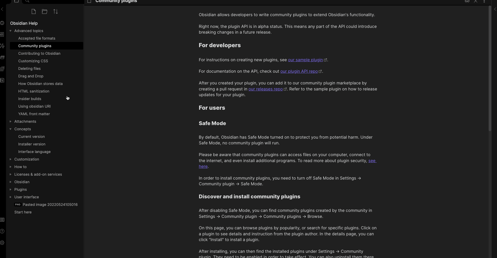
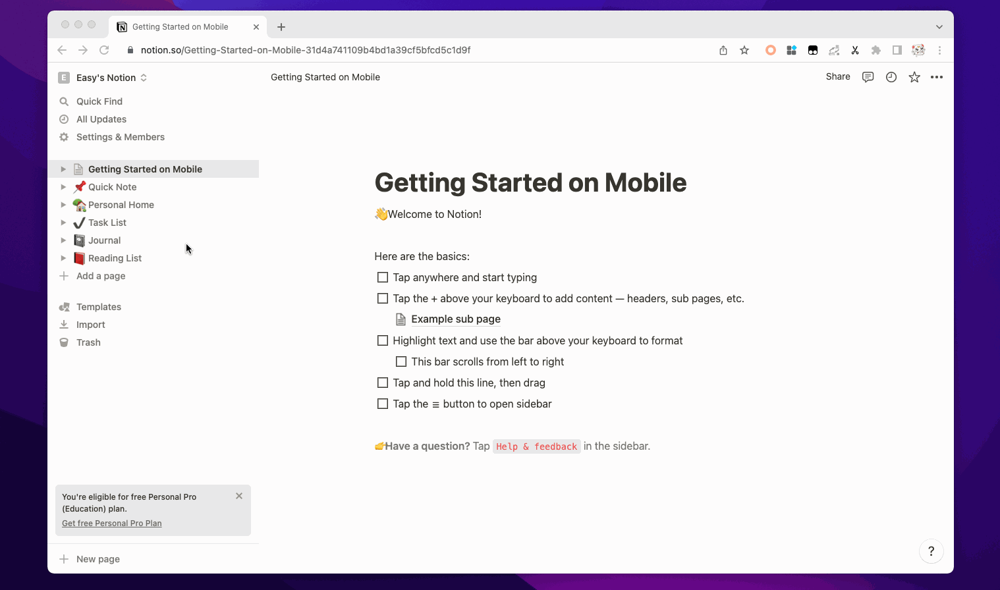
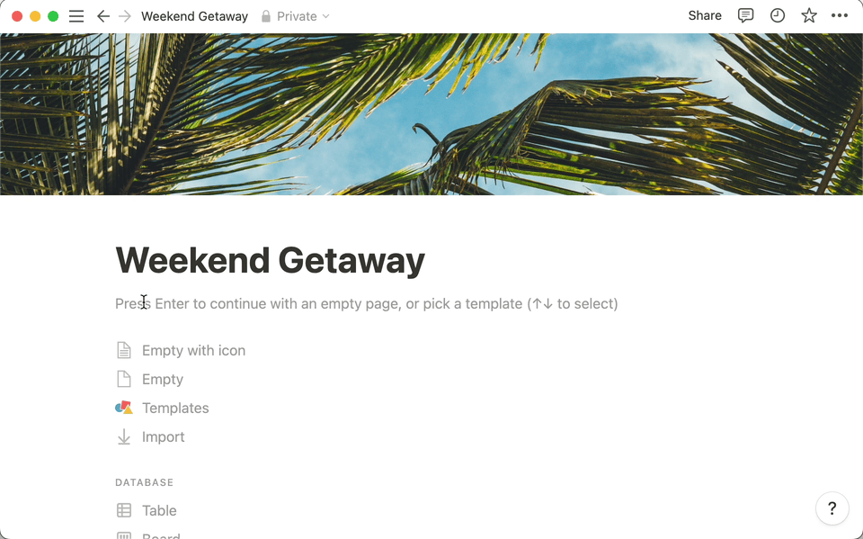
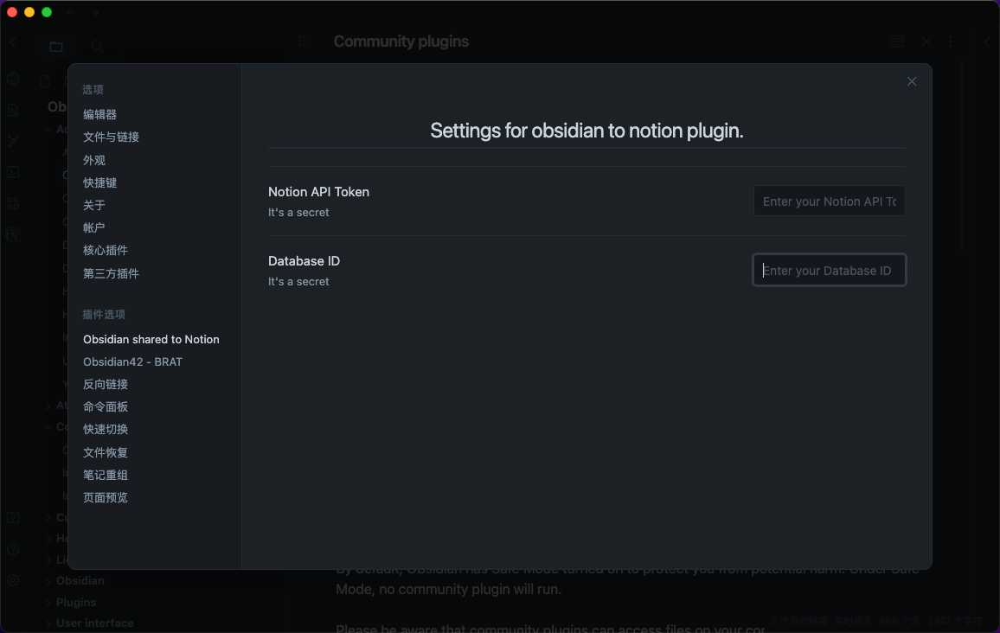
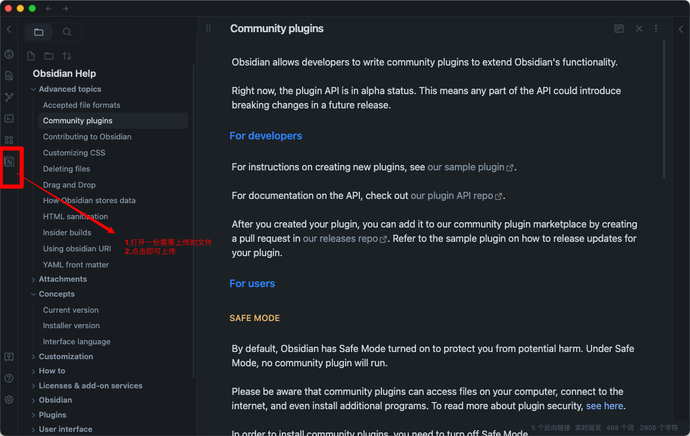
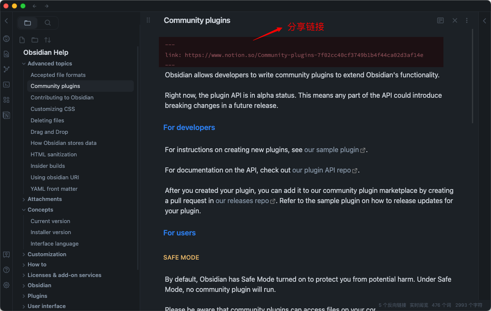
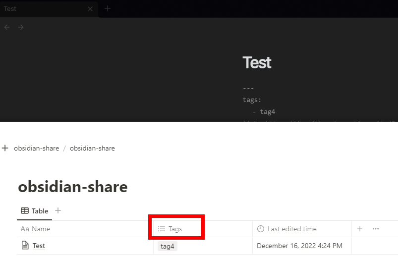

# Obsidian to Notion
[](https://github.com/Easychris/obsidian-to-notion/actions/workflows/CI.yml)
[](https://github.com/Easychris/obsidian-to-notion/actions/workflows/release.yml)
[](https://raw.githubusercontent.com/EasyChris/obsidian-to-notion/master/LICENSE)
[](https://GitHub.com/Easychris/obsidian-to-notion/releases/)
[](https://github.com/Easychris/obsidian-to-notion/releases)


Share of obsidian to Notion [中文文档](README-zh.md)

Sharing files from Obsidian to Notion with a single click, and Obsidian will automatically add the Notion share link

You are welcome to offer it a star if it can benefit you.



# TODO
### [TODO Board](https://github.com/users/EasyChris/projects/3/views/1)
- [x] support for custom page banner
- [x] update the exsit page
- [x] support for mult language
- [x] support for auto copy the share link to clipboard
- [x] support for mobile
- [ ] transfer the bi-link format like [[]] into the format that Notion supports.


# How to use
## Install the plugin

### Marketplace download
Open obsidian setting -> Add plugin -> Search -> notion


### BRAT
Enter `BRAT` into the plugin market center to find it.
Add `EasyChris/obsidian-to-notion` to the list of BRAT plugins that have been installed.
Return to the plugin center and turn it on.
### Manual installation
```
cd YOUR_OBSIDIAN_FOLDER/.obsidian/plugins/
git clone https://github.com/EasyChris/obsidian-to-notion.git
```


## Apply Notion API
Official reference documentation: [https://developers.notion.com/docs](https://developers.notion.com/docs)
### Step 1: Create integration.
Go to [https://www.notion.com/my-integrations](https://www.notion.com/my-integrations)
Once created, copy `secrets toekn`


#### Note:
database first custom name must be "Name", otherwise sync to notion will be failed


### Step 2: Share a database with your integration
Create a new page (with public permissions)
Create a new database in the page -> you need `full page database`


Add `integration` to your new database



### Step 3: Copy the database ID

```
https://www.notion.so/myworkspace/a8aec43384f447ed84390e8e42c2e089?v=...
                                  | --------- Database ID --------|

```


## Open the plugin configuration
Fill the configuration with the `NOTION_API_KEY` and `DATABASE_ID` you got


## Upload file content to notion
Click the upload notion button

A share link will be automatically generated after successful upload



## Banner URL [option]
banner url must be a image url like: https://i.imgur.com/xxx.jpg
if you don't want to use banner, leave it blank

## Notion ID [option]
Notion ID is the your notion site ID that you want to share the file to.
if you don't write it, notion will share to the default link like: 
https://www.notion.so/myworkspace/a8aec43384f447ed84390 
that visit this page need to redirect to your site url 
if you write the Notion ID, it will share to the page link like: 
https://your_user_name.notion.site/myworkspace/a8aec43384f447ed84390. 
The visiter don't need to redirect url.

## Convert Tags [option]
Transfer the Obsidian tags to the Notion table.
It requires the column with the name 'Tags'.


## Sync image to Notion

To sync images to your oss or cos bucket, use the [Obsidian Image Auto Upload Plugin](https://github.com/renmu123/obsidian-image-auto-upload-plugin).

# Buy me a cup of coffee.

[Buy me a coffee](https://dun.mianbaoduo.com/@easy)


# Development

```
git clone https://github.com/EasyChris/obsidian-to-notion.git
yarn install
yarn dev
```


# Thanks
[Development Process | Obsidian Plugin Development Documentation](https://luhaifeng666.github.io/obsidian-plugin-docs-zh/zh/getting-started/development-workflow.html)

[GitHub - devbean/obsidian-wordpress: An obsidian plugin for publishing docs to WordPress.](https://github.com/devbean/obsidian-wordpress)

[GitHub - obsidianmd/obsidian-api](https://github.com/obsidianmd/obsidian-api)

[GitHub - Easychris/obsidian-to-notion: Obsidian Weread Plugin is an plugin to sync Weread(微信读书) hightlights and annotations into your Obsidian Vault.](https://github.dev/zhaohongxuan/obsidian-weread-plugin)

[GitHub - Quorafind/Obsidian-Memos: A quick capture plugin for Obsidian, all data from your notes.](https://github.com/Quorafind/Obsidian-Memos)

# License
GNU GPLv3
